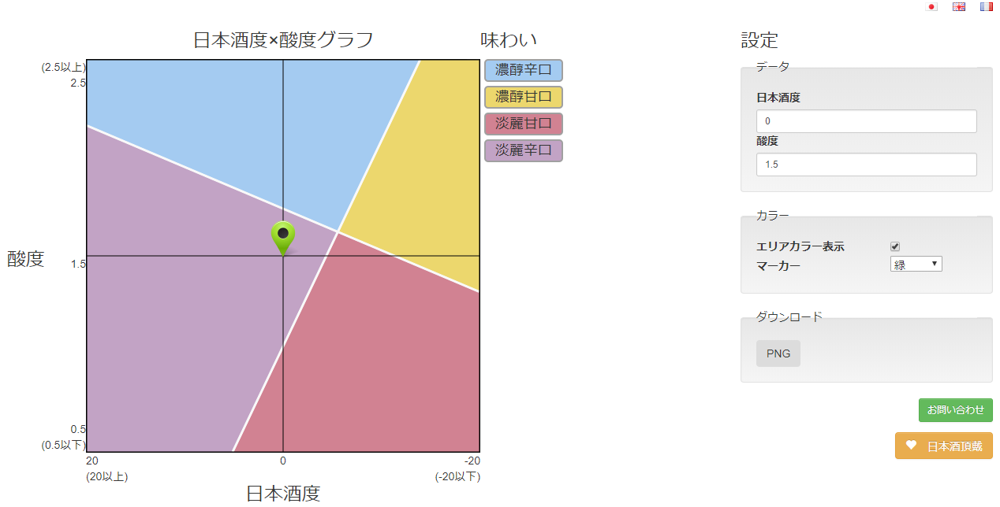

# Sakechart2

## Requirements

 - PHP Gettext

## Setup

Define you email address in `library/sendmail.php` on *line 6*  

## Description  

A JS chart to classify Japanese sake I did a long time ago.

You just need a web server running `PHP`.  
PHP is required to use I18n translations.

Available in:
 + Japanese
 + English
 + French

## Improvements

 - Better look and feel using Bootstrap
 - Contact form

# Screenshots  

